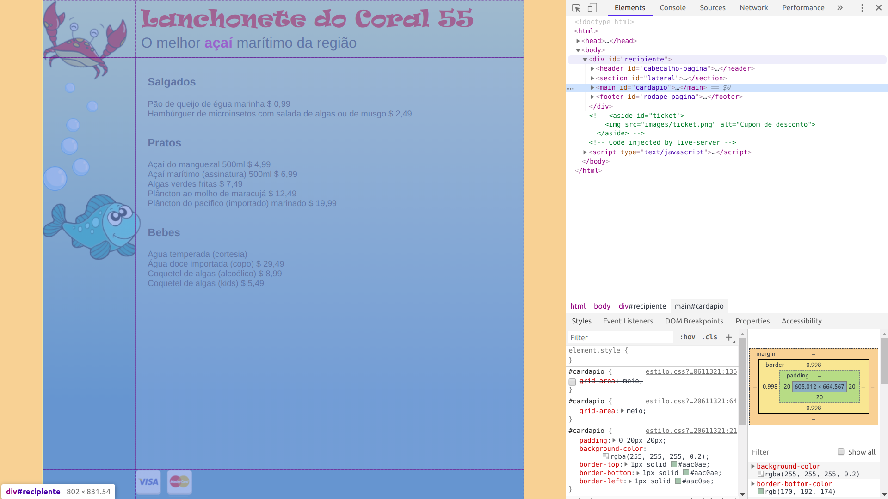
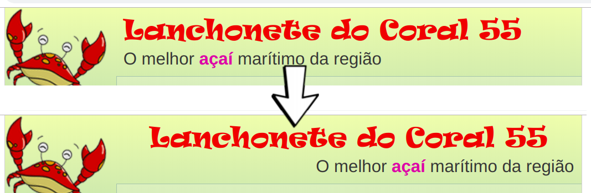
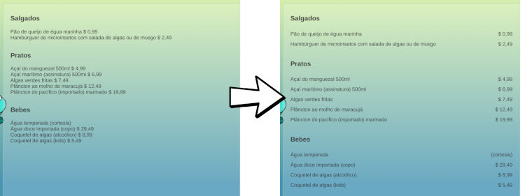
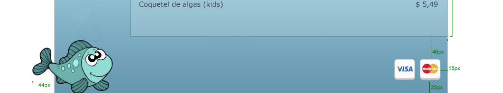
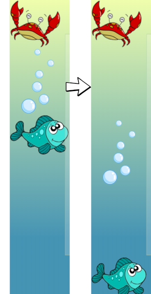
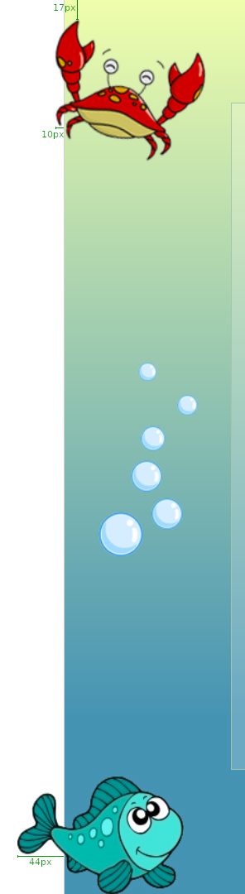
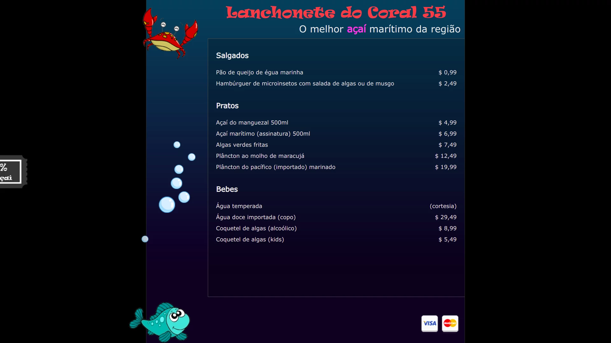

# Lanchonete do Coral 55

Um cardápio das gostosuras marítimas servidas na Lanchonete do Coral 55.


## Atividade

Você deve estilizar a página do cardápio (arquivo `index.html`) de forma a
implementar o _comprehensive layout_ criado por um _designer_ (arquivo
`coral55-comp.png`). Você deve usar a especificação do _layout_ (arquivo
`coral55-specs.png`).


### Exercício 1: fontes

Na pasta `fonts/` há arquivos referentes a duas fontes: **ravie** e **verdana**,
que devem ser usadas respectivamente para o título de 1º nível e para
o restante dos elementos. Inclusive, já existe um arquivo `fonts/ravie.css`
com a configuração dessa fonte, e esse arquivo pode ser incluído diretamente
no HTML (via `<link rel="stylesheet">`) ou por dentro do `estilo.css` usando:

```css
@import "caminho-para-arquivo.css";
```

Para a fonte **verdana**, você deve criar um `fonts/verdana.css` de forma
análoga ao da outra fonte e incluí-lo também.


### Exercício 2: layout geral da página (elemento `#recipiente`)

Como este é um layout de largura fixa, o `#recipiente` deve ter sua
largura definida e deve ser centralizado. Lembre-se que, para centralizar
um elemento _block_, basta definir suas margens laterais como automáticas.
Quanto à altura, faça com que `html, body, #recipiente` tenham
altura mínima de `100vh`.

Vamos usar `display: grid` para dividir a página em 2 colunas e 3 linhas,
da seguinte forma:



Atente-se para as dimensões das linhas e colunas, de acordo com o que
foi descrito nas _specs_. Considere que novos itens podem ser
adicionados ao cardápio no futuro ao definir a forma de crescimento das linhas.

Outro detalhe importante: por padrão todo `body` possui uma pequena
margem (`8px`). Para que o `#recipiente` consiga "encostar" no topo
e lá em baixo, você deve remover essa margem.


### Exercício 3: cabeçalho (elemento `#cabecalho-pagina`)



Para estilizar o cabeçalho da página (`#cabecalho-pagina`), 
**inicialmente pode parecer uma boa ideia** torná-lo um flex com a
direção de coluna (vertical: `flex-direction: column`) e usar
`align-self: center` e `align-self: flex-end` para `<h1>` e `<h2>` respectivamente.

Contudo, isso é desnecessário visto que conseguimos usar basicamente
a propriedade `text-align` com valores diferentes para `<h1>` e `<h2>`.
A dica aqui é: não é porque flexbox é super legal que precisamos transformar
tudo em flex. Na dúvida, sempre siga o caminho mais simples ;)

Além do alinhamento, note que as _specs_ definem um espaçamento.
Para refletir: faz sentido usar `padding` ou `margin`? E em qual elemento?
Para ver a diferença entre os dois, veja o [FAQ](#faq).


### Exercício 4: o cardápio (`#cardapio`)

Primeiramente, repare que deve haver um espaçamento interno em `#cardapio`
(conforme _specs_) nas laterais.

Estilize cada item do `#cardápio` (ou seja, cada `article`) de maneira
a deixar o nome do item à esquerda e o preço à direita - use flexbox
no `article` para isso.

Após ter feito isso, aumente o espaçamento vertical entre os itens do
menu para um espaçamento duplo (veja [FAQ](#faq)) para dar um
"arejamento" ao  texto. Deve ficar assim:




### Exercício 5: rodapé (`#rodape-pagina`)

Estilize o rodapé considerando as _specs_. Use flexbox para posicionar
a imagem dos cartões à direita. Além disso, use propriedades como `margin`,
`padding`, `height` etc. para definir o espaçamento como solicitado.




### Exercício 6: seção lateral (`#lateral`) ↘️



Estilize a seção lateral, que contém as imagens do siri, da bolha e do
peixe, de maneira que o siri fique lá em cima, a bolha no meio e o peixe
lá em baixo: use flexbox.


### Exercício 7: _ticket_ (`#ticket`)

Em `index.html` há um código comentado que coloca um ticket na página.
Descomente esse código e, usando seus conhecimentos da propriedade `position`,
estilize-o de maneira que mesmo se a página rolar, ele fique parado, fixado
em sua posição, que é centralizada verticalmente. Pode ser útil saber que a
imagem do ticket tem `84px` de altura. Para lembrar, veja os slides sobre
centralização de elementos posicionados no [FAQ](#faq).

Faça com que ele fique escondido, deslocado `-89px` (à esquera) e,
quando o mouse passar sobre ele, que ele se revele (ou seja, deslocado `0`).

Configure uma transição CSS para que o `#ticket` se movimente
de maneira animada. Para isso, veja o [FAQ](#faq).


### Exercício 8: deslocamentos das imagens

Como um retoque final, desloque as imagens do `#siri` e do `#peixe`,
conforme as specs. Esse deslocamento pode ser feito usando **posicionamento
relativo**.




### Exercício 9: alterando as borbolhas

Inclua o arquivo `js/bubbles.js` e veja como ficou. Tente modificar o
intervalo de surgimento das bolhas para algo bem mais rápido.


### Exercício 10: modo escuro 

Para finalizar, vamos usar _custom properties_ e uma _media query_
para criar um modo escuro para a página.

O primeiro passo será criar uma _custom property_ para conter cada
cor usada na página e substituir os usos dessas cores para usar as variáveis.
Por exemplo, veja um "antes e depois":

- Antes:
  ```css
  #cardapio article {
    color: #333;
  }
  ```
- Depois:
  ```css
  :root {
    --cor-do-texto: #333;
  }

  /*...*/

  #cardapio article {
    color: var(--cor-do-texto);
  }
  ```

Em seguida, você deve criar uma _media query_ de preferência de usuário
para sobrescrever os valores dessas _custom properties_:

```css
@media (prefers-color-scheme: dark) {
  :root {
    --cor-do-texto: #eee;
    /* ... */
  }
}
```

Por fim, você deve alterar o HTML para avisar o navegador que a
página tem suporte ao modo escuro e modo claro, com preferência
para o modo claro. Para tanto, use a seguinte _meta tag_:

```html
<meta name="color-scheme" content="light dark">
```

**PARA TESTAR**: usando a ferramenta do desenvolver, você pode
forçar a preferência do usuário para modo escuro ou claro:


Se quiser ver um exemplo dos estilos:



## <abbr title="Frequently Asked Questions">FAQ</abbr>

- Para fazer uma **transição suave da posição** `left` de um elemento, usamos
  a propriedade `transition`:
  ```css
  #elemento {
    /* ... */
    left: -100px;
    transition: left 100ms ease-out; /* propriedade, duração, interpolação */
  }
  #element:hover {
    left: 0;
  }
  ```
- Margin e Padding: qual a diferença? Veja os slides sobre [margem e padding][margem-e-padding].
- Me esqueci das propriedades do Flexbox... onde acho?
  Há um excelente tutorial do site CSS Tricks: https://css-tricks.com/snippets/css/a-guide-to-flexbox/.
  Também tem os [slides sobre Flexbox][slides-flex].
- Me esqueci das propriedades do Grid... onde acho? Há um excelente tutorial do
  site CSS Tricks: https://css-tricks.com/snippets/css/complete-guide-grid/. Também tem os
  [slides sobre Grid][slides-grid].
- Veja os [slides sobre centralização de elementos posicionados][centralizacao-vertical].
- Para incluir um _script_ na página, coloque uma _tag_ 
  `<script src="caminho-para-arquivo.js"></script>` no final do `<body>`, logo antes do `</body>`.
- Para relembrar como criar "variáveis" em CSS, veja os [slides sobre _custom properties_][slides-custom-properties]


[centralizacao-vertical]: https://fegemo.github.io/cefet-web/classes/css4/#centralizando-elementos-posicionados
[line-height]: https://fegemo.github.io/cefet-web/classes/css4/#a-propriedade-line-height
[margem-e-padding]: http://fegemo.github.io/cefet-web/classes/html2/#margin-e-padding
[slides-flex]: http://fegemo.github.io/cefet-web/classes/css3/#flexbox
[slides-grid]: http://fegemo.github.io/cefet-web/classes/css3/#grid
[slides-custom-properties]: http://fegemo.github.io/cefet-web/classes/css4/#custom-properties